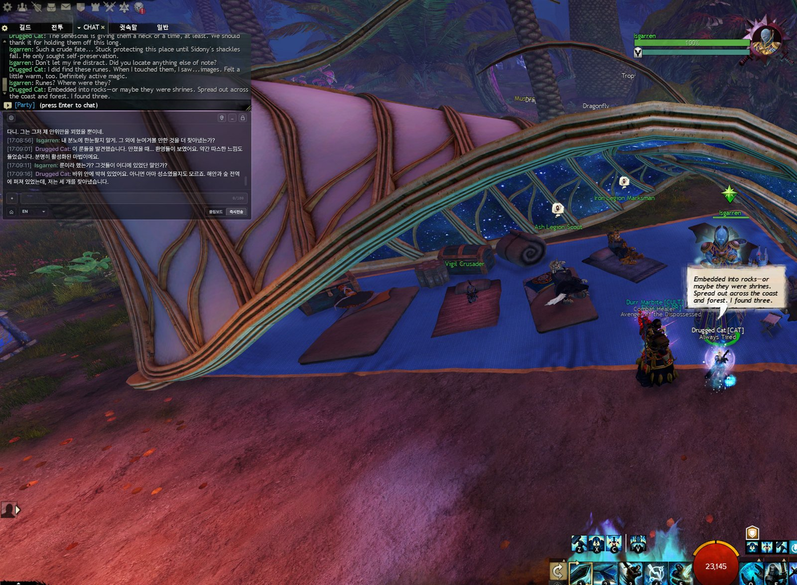
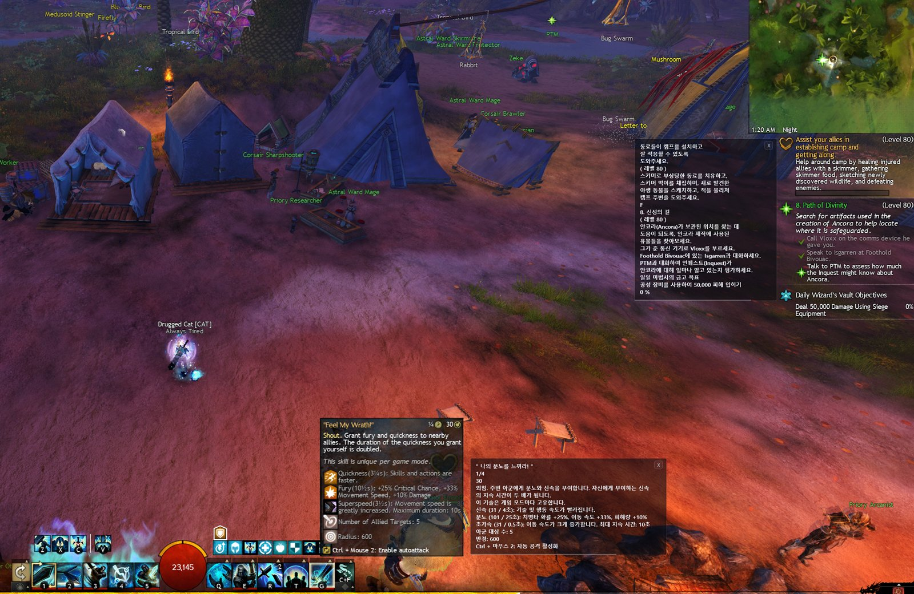
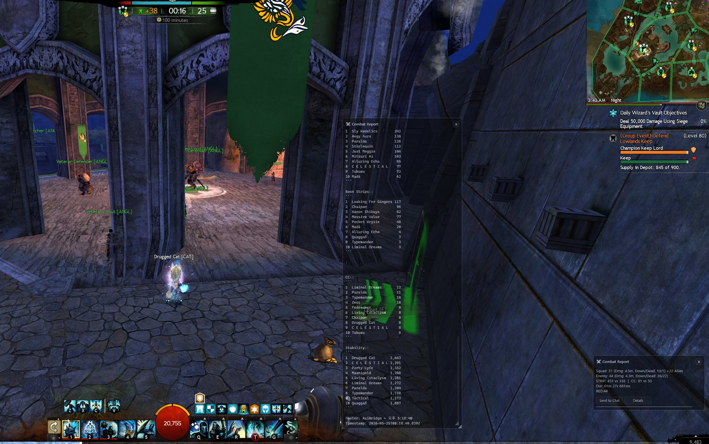

<p align="center">
  
</p>

# CatBridge

**Play Guild Wars 2 in your language.**

CatBridge translates story dialogue, party and squad chat, screen OCR, Discord voice, TTS, voice chat input, custom cursors, and WvW combat reports in one Guild Wars 2 companion app.

From V1.1.2, CatBridge also includes an experimental All Chat Translation mode that can be enabled at the user's own responsibility after accepting the in-app notice.

Official site: https://catbridge.guildwar.win

> CatBridge is closed-source software. This repository is used for public releases, issue tracking, and update notes.

## The App

Choose a language and translation engine, then start playing.

CatBridge runs while Guild Wars 2 is open. Menus and settings can use several UI languages. Even if a UI language is not available, chat and dialogue translation still work.


CatBridge initial setup page. The UI changes to the language you choose when that UI locale is available. If the UI locale is not available, all features still work.

## Story, Chat, And Your Own Messages

NPC dialogue and party or squad chat are translated natively. Your own message can be translated before you send it.

<table>
  <tr>
    <td width="50%">
      <br>
      <strong>Story translation</strong> keeps NPC lines readable while the game stays open.
    </td>
    <td width="50%">
      <br>
      <strong>Outgoing chat</strong> can be sent instantly in the selected language, or copied first when you want to check it.
    </td>
  </tr>
</table>

## See It In Action

Multilingual translation examples from earlier CatBridge builds.

<table>
  <tr>
    <td width="50%">
      <br>
      <strong>Party chat</strong><br>Japanese<br><em>Old UI screenshot.</em>
    </td>
    <td width="50%">
      <br>
      <strong>Party chat</strong><br>Portuguese<br><em>Old UI screenshot.</em>
    </td>
  </tr>
  <tr>
    <td width="50%">
      <br>
      <strong>NPC story</strong><br>Turkish<br><em>Old UI screenshot.</em>
    </td>
    <td width="50%">
      <br>
      <strong>NPC story</strong><br>Polish<br><em>Old UI screenshot.</em>
    </td>
  </tr>
</table>

CatBridge supports dozens of languages through free translation engines and optional AI engines, including English, French, German, Spanish, Russian, Arabic, and Thai.

## More Than Chat Translation

CatBridge now covers native translation, OCR, Discord voice translation, cursor tools, and WvW reports.



**OCR** translates text you drag on screen, and can also translate a saved chat area with a hotkey.

<table>
  <tr>
    <td width="33%">
      <br>
      <strong>Discord voice translation</strong> captures the Discord voice session and shows captions in the language you choose.
    </td>
    <td width="33%">
      <br>
      <strong>Mobility Tech</strong> replaces the GW2 cursor. You can customize it, share presets by code, and change colors between combat and non-combat states.
    </td>
    <td width="33%">
      <br>
      <strong>Combat Tech</strong> uses AxiBridge to share quick WvW combat reports in chat or view detailed results in an overlay window.
    </td>
  </tr>
</table>

## Translation First, Useful Tools Around It

Understand story, talk with players, translate screen text, and handle voice without leaving the game.

| Feature | What it does |
| --- | --- |
| NPC & Story Translation | NPC dialogue appears in real time on a dedicated overlay. AI engines can use CatBridge's 273-character persona dictionary to keep character tone more consistent. |
| Two-Way Chat Translation | Party and squad messages are translated from game data. Type in your language, choose a target language, then copy it or send it instantly. |
| OCR Screen Translation | Drag over objectives, skills, achievements, dialogue choices, or chat channels that native translation cannot read. OCR is fast and recognition is strong. |
| Discord Voice Translation | Capture the Discord voice session, translate speech, and show captions in the language you choose. Lock the caption window for click-through play. |
| Mobility Tech | Replace or overlay the GW2 cursor, customize shape and color, and share cursor presets with a code. |
| Combat Tech | With AxiBridge, WvW fights can produce quick chat reports and detailed combat windows inside the game. |
| API & Engine Setup | Start free with M, B, C, P, or Google. Add the AI engine you prefer when you want stronger translation. |

## How It Works

CatBridge is a standalone app that receives game data through ArcDPS.

```text
Guild Wars 2 -> ArcDPS -> Unofficial Extras -> arcdps_catbridge.dll -> CatBridge
```

- **ArcDPS** hooks into the game client to collect data.
- **Unofficial Extras** extracts additional info such as squad and chat data.
- **arcdps_catbridge.dll** bridges that data to CatBridge through a named pipe.
- **CatBridge** handles translation, overlay rendering, and AI features.

ArcDPS, Unofficial Extras, and `arcdps_catbridge.dll` must all live in the same directory. If you use an addon manager like Nexus, ArcDPS may be in a subfolder; make sure the bridge DLL is placed alongside the actual ArcDPS installation.

## Notes

CatBridge is not affiliated with, endorsed by, or approved by ArcDPS, arcdps_unofficial_extras, or AxiBridge.

CatBridge is an unofficial fan-made tool and is not affiliated with, endorsed by, or approved by ArenaNet or NCSOFT.
