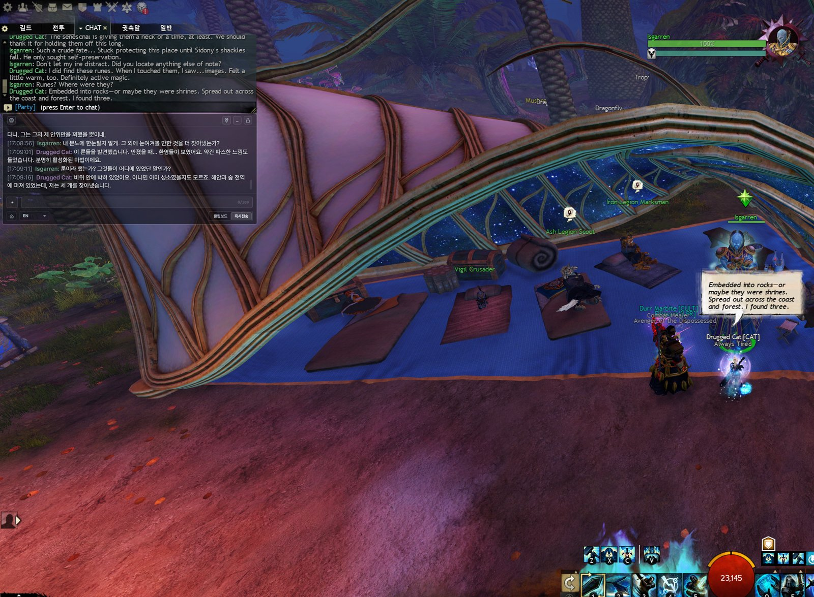
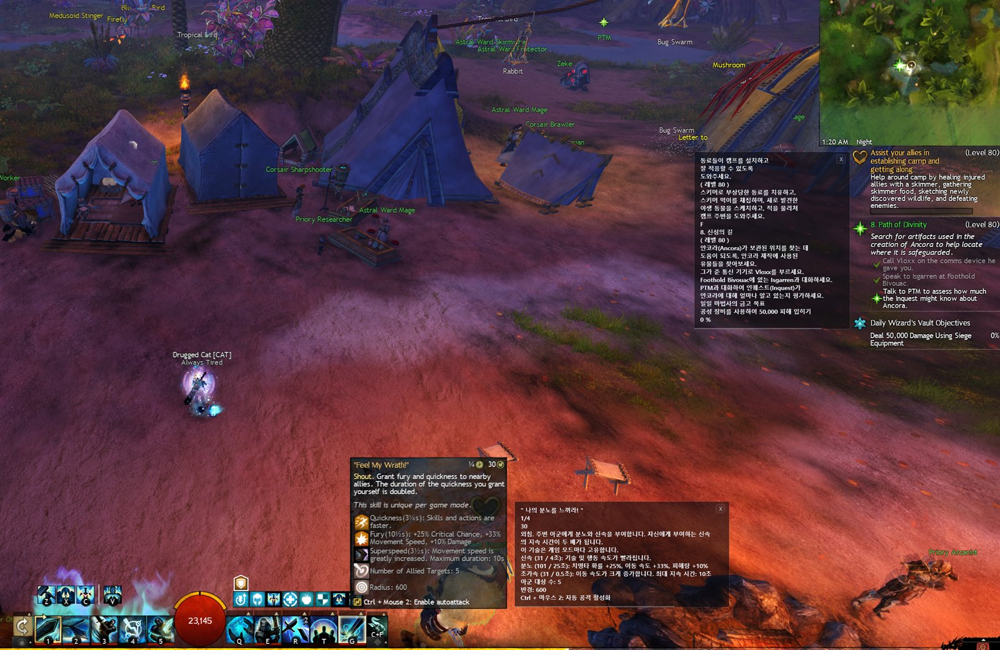
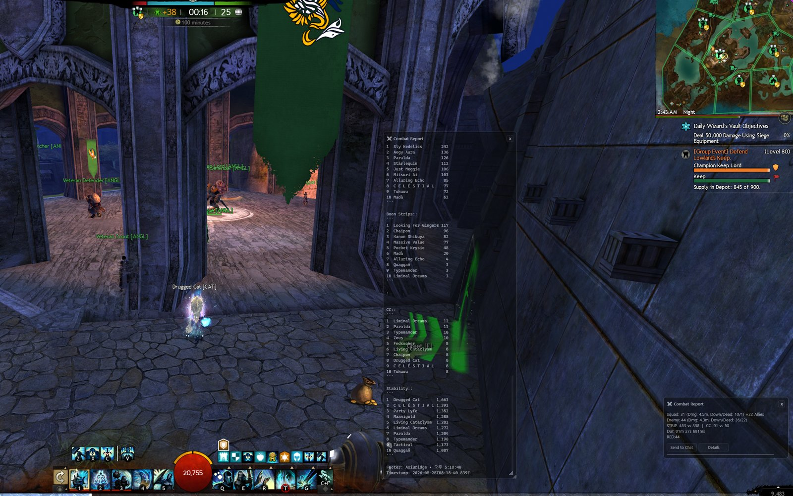

<p align="center">
  
</p>

# CatBridge

**Play Guild Wars 2 in your language.**

CatBridge translates story dialogue, Guild Wars 2 chat, screen OCR, Discord voice, TTS, voice chat input, custom cursors, and WvW combat reports in one companion app.

Official site: https://catbridge.guildwar.win

Community Discord: https://discord.gg/hndrDWN7zA

> CatBridge is closed-source software. This repository is used for public releases, issue tracking, and update notes.

## The App

Choose a language and translation engine, then start playing.

CatBridge runs while Guild Wars 2 is open. Menus and settings can use several UI languages. Even if a UI language is not available, chat and dialogue translation still work.


CatBridge initial setup page. The UI changes to the language you choose when that UI locale is available. If the UI locale is not available, all features still work.

## Story, Chat, And Your Own Messages

NPC dialogue and Guild Wars 2 chat are translated directly from game data. Your own message can be translated before you send it.

<table>
  <tr>
    <td width="50%">
      <br>
      <strong>Story translation</strong> keeps NPC lines readable while the game stays open.
    </td>
    <td width="50%">
      <br>
      <strong>Outgoing chat</strong> can be sent instantly in the selected language, or copied first when you want to check it.
    </td>
  </tr>
</table>

## See It In Action

Multilingual translation examples from earlier CatBridge builds.

<table>
  <tr>
    <td width="50%">
      <br>
      <strong>Party chat</strong><br>Japanese<br><em>Old UI screenshot.</em>
    </td>
    <td width="50%">
      <br>
      <strong>Party chat</strong><br>Portuguese<br><em>Old UI screenshot.</em>
    </td>
  </tr>
  <tr>
    <td width="50%">
      <br>
      <strong>NPC story</strong><br>Turkish<br><em>Old UI screenshot.</em>
    </td>
    <td width="50%">
      <br>
      <strong>NPC story</strong><br>Polish<br><em>Old UI screenshot.</em>
    </td>
  </tr>
</table>

CatBridge supports dozens of languages through free translation engines and optional AI engines, including English, French, German, Spanish, Russian, Arabic, and Thai.

## More Than Chat Translation

CatBridge now covers native translation, OCR, Discord voice translation, cursor tools, and WvW reports.



**OCR** translates non-chat screen text such as objectives, skills, achievements, and dialogue choices by dragging over it.

<table>
  <tr>
    <td width="33%">
      <br>
      <strong>Discord voice translation</strong> captures the Discord voice session and shows captions in the language you choose.
    </td>
    <td width="33%">
      <br>
      <strong>Mobility Tech</strong> replaces the GW2 cursor. You can customize it, share presets by code, and change colors between combat and non-combat states.
    </td>
    <td width="33%">
      <br>
      <strong>Combat Tech</strong> uses AxiBridge to share quick WvW combat reports in chat or view detailed results in an overlay window.
    </td>
  </tr>
</table>

## Translation First, Useful Tools Around It

Understand story, talk with players, translate screen text, and handle voice without leaving the game.

| Feature | What it does |
| --- | --- |
| NPC & Story Translation | NPC dialogue appears in real time on a dedicated overlay. AI engines can use CatBridge's 273-character persona dictionary to keep character tone more consistent. |
| Two-Way Chat Translation | Guild, Map, Team, Say, Whisper, Party, and Squad messages are translated from game data. Type in your language, choose a target language, then copy it or send it instantly. |
| OCR Screen Translation | Drag over objectives, skills, achievements, dialogue choices, and other non-chat screen text. OCR is fast and recognition is strong. |
| Discord Voice Translation | Capture the Discord voice session, translate speech, and show captions in the language you choose. Lock the caption window for click-through play. |
| Mobility Tech | Replace or overlay the GW2 cursor, customize shape and color, and share cursor presets with a code. |
| Combat Tech | With AxiBridge, WvW fights can produce quick chat reports and detailed combat windows inside the game. |
| API & Engine Setup | Start free with M, B, C, P, or Google. Add the AI engine you prefer when you want stronger translation. |

## How It Works

CatBridge runs as a separate app that handles translation and overlays. One connection method is needed to pass Guild Wars 2 chat and NPC dialogue to CatBridge.

```text
Guild Wars 2
   ├─ Connect through ArcDPS
   ├─ Connect through Nexus
   └─ Connect through Version.dll
                    ↓
                CatBridge
```

ArcDPS, Nexus, and Version.dll are not different versions of CatBridge. They are three ways to connect the same CatBridge app to the game.

- **Connect through ArcDPS** to load CatBridge alongside ArcDPS.
- **Connect through Nexus** to load CatBridge through the Nexus addon environment.
- **Connect through Version.dll** to use CatBridge without ArcDPS or Nexus.

At least one connection method is required. You can install two or all three methods together without conflicts or duplicate output.

## Installation

1. Fully close Guild Wars 2.
2. Download the latest [CatBridge Setup](https://github.com/motionsilse/CatBridge/releases).
3. Run Setup and select the Guild Wars 2 folder that contains `Gw2-64.exe`.
4. Choose ArcDPS, Nexus, Version.dll, or any combination of them.
5. When installation finishes, launch CatBridge.

All three connection methods are selected by default. If you are not sure which one to use, you can leave the default selection unchanged.

Setup never overwrites an existing `version.dll` that it does not own. If that file already supports CatBridge integration, such as Korean Patch 0.4.1 or later, it already provides the Version.dll connection and no additional method is required.

### Runtime requirements

- Use **Windowed Fullscreen** or **Windowed** display mode. Exclusive Fullscreen hides the overlay.
- CatBridge and Guild Wars 2 must both be running to use translation and overlay features.

### If the overlay opens but nothing is translated

Fully close Guild Wars 2 and CatBridge, then start them again. If translation still does not appear, run CatBridge Setup again and confirm that at least one connection method is available.

Party or squad chat is designed to resume after reconnecting, but in some cases you may still need to leave and rejoin the group.

For detailed installation steps and troubleshooting, see the [full installation guide](https://catbridge.guildwar.win/install/).

## Use Notice

Use CatBridge at your own discretion.

CatBridge is provided as-is and is intended to be helpful, but I cannot take responsibility for any issues, losses, or account-related problems that may occur from using it.

Guild Wars 2 third-party addons and overlay tools are always used at your own risk.

CatBridge is not affiliated with, endorsed by, or approved by ArcDPS or AxiBridge.

CatBridge is an independent community project and is not affiliated with, endorsed by, or sponsored by ArenaNet or NCSOFT.

---

<p align="center">
  
</p>

# CatBridge (한국어)

**Guild Wars 2를 원하는 언어로 플레이하세요.**

CatBridge는 스토리 대사, Guild Wars 2 채팅, 화면 OCR, Discord 음성, TTS, 음성 채팅 입력, 커스텀 커서, WvW 전투 보고서를 하나의 보조 앱에서 지원합니다.

공식 사이트: https://catbridge.guildwar.win

커뮤니티 Discord: https://discord.gg/hndrDWN7zA

> CatBridge는 비공개 소스 소프트웨어입니다. 이 저장소는 공개 릴리즈, 문제 제보, 업데이트 안내에 사용됩니다.

## 앱

언어와 번역 엔진을 선택한 뒤 게임을 시작하면 됩니다.

CatBridge는 Guild Wars 2가 실행되는 동안 함께 작동합니다. 메뉴와 설정은 여러 UI 언어를 지원합니다. 원하는 UI 언어가 제공되지 않더라도 채팅과 대사 번역 기능은 그대로 사용할 수 있습니다.


CatBridge의 초기 설정 화면입니다. 선택한 언어의 UI 번역이 제공되면 앱 화면도 해당 언어로 바뀝니다. UI 번역이 제공되지 않는 언어를 선택해도 모든 기능은 정상적으로 작동합니다.

## 스토리, 채팅, 내가 보내는 메시지

NPC 대사와 Guild Wars 2 채팅은 게임 데이터에서 직접 가져와 번역합니다. 내가 보낼 메시지도 전송 전에 번역할 수 있습니다.

<table>
  <tr>
    <td width="50%">
      <br>
      <strong>스토리 번역</strong>은 게임을 플레이하는 동안 NPC 대사를 읽기 쉽게 표시합니다.
    </td>
    <td width="50%">
      <br>
      <strong>보내는 채팅</strong>은 선택한 언어로 즉시 전송하거나, 내용을 먼저 확인할 수 있도록 복사할 수 있습니다.
    </td>
  </tr>
</table>

## 실제 번역 예시

이전 CatBridge 버전에서 촬영한 여러 언어의 번역 예시입니다.

<table>
  <tr>
    <td width="50%">
      <br>
      <strong>파티 채팅</strong><br>일본어<br><em>이전 UI 화면입니다.</em>
    </td>
    <td width="50%">
      <br>
      <strong>파티 채팅</strong><br>포르투갈어<br><em>이전 UI 화면입니다.</em>
    </td>
  </tr>
  <tr>
    <td width="50%">
      <br>
      <strong>NPC 스토리</strong><br>튀르키예어<br><em>이전 UI 화면입니다.</em>
    </td>
    <td width="50%">
      <br>
      <strong>NPC 스토리</strong><br>폴란드어<br><em>이전 UI 화면입니다.</em>
    </td>
  </tr>
</table>

CatBridge는 무료 번역 엔진과 선택형 AI 엔진을 통해 한국어, 영어, 프랑스어, 독일어, 스페인어, 러시아어, 아랍어, 태국어를 비롯한 수십 개 언어를 지원합니다.

## 채팅 번역 그 이상

CatBridge는 게임 데이터 기반 번역, OCR, Discord 음성 번역, 커서 도구, WvW 전투 보고서를 함께 제공합니다.


**OCR**은 화면을 드래그해 목표, 스킬, 업적, 대화 선택지처럼 채팅이 아닌 게임 화면의 글자를 번역합니다.

<table>
  <tr>
    <td width="33%">
      <br>
      <strong>Discord 음성 번역</strong>은 Discord 음성 세션을 캡처하고 선택한 언어의 자막으로 표시합니다.
    </td>
    <td width="33%">
      <br>
      <strong>Mobility Tech</strong>는 GW2 커서를 교체합니다. 모양을 꾸미고, 프리셋 코드를 공유하고, 전투 및 비전투 상태에 따라 색상을 바꿀 수 있습니다.
    </td>
    <td width="33%">
      <br>
      <strong>Combat Tech</strong>는 AxiBridge를 사용해 간단한 WvW 전투 보고서를 채팅으로 공유하거나 자세한 결과를 오버레이 창에서 보여줍니다.
    </td>
  </tr>
</table>

## 번역을 중심으로, 필요한 도구까지

게임을 벗어나지 않고 스토리를 이해하고, 다른 플레이어와 대화하고, 화면의 글자와 음성을 번역할 수 있습니다.

| 기능 | 설명 |
| --- | --- |
| NPC 및 스토리 번역 | NPC 대사를 전용 오버레이에 실시간으로 표시합니다. AI 엔진은 CatBridge의 273개 캐릭터 페르소나 사전을 활용해 캐릭터의 말투를 더욱 일관되게 유지할 수 있습니다. |
| 양방향 채팅 번역 | 길드, 맵, 팀, 일반, 귓속말, 파티, 스쿼드 채팅을 게임 데이터에서 가져와 번역합니다. 원하는 언어로 입력하고 대상 언어를 선택한 뒤 복사하거나 즉시 전송할 수 있습니다. |
| OCR 화면 번역 | 목표, 스킬, 업적, 대화 선택지를 비롯한 채팅 외 화면의 글자를 드래그해 번역합니다. 빠르고 인식 성능이 뛰어납니다. |
| Discord 음성 번역 | Discord 음성 세션을 캡처하고 음성을 번역해 선택한 언어의 자막으로 표시합니다. 자막 창을 잠그면 클릭을 방해하지 않습니다. |
| Mobility Tech | GW2 커서를 교체하거나 덧씌우고, 모양과 색상을 꾸미며, 커서 프리셋을 코드로 공유할 수 있습니다. |
| Combat Tech | AxiBridge를 사용하면 WvW 전투의 간단한 보고서를 채팅으로 공유하고 자세한 전투 결과를 게임 안의 별도 창에서 확인할 수 있습니다. |
| API 및 엔진 설정 | M, B, C, P 또는 Google을 이용해 무료로 시작할 수 있습니다. 더 나은 번역을 원할 때 원하는 AI 엔진을 추가할 수 있습니다. |

## 작동 방식

CatBridge는 번역과 오버레이 표시를 처리하는 별도의 앱입니다. Guild Wars 2의 채팅과 NPC 대사를 CatBridge로 전달하려면 게임 연결 방식이 하나 필요합니다.

```text
Guild Wars 2
   ├─ ArcDPS로 연결
   ├─ Nexus로 연결
   └─ Version.dll로 연결
                 ↓
             CatBridge
```

ArcDPS, Nexus, Version.dll은 서로 다른 CatBridge가 아니라 같은 CatBridge를 게임에 연결하는 세 가지 방법입니다.

- **ArcDPS로 연결**하면 ArcDPS와 함께 CatBridge를 불러옵니다.
- **Nexus로 연결**하면 Nexus 애드온 환경에서 CatBridge를 불러옵니다.
- **Version.dll로 연결**하면 ArcDPS나 Nexus 없이 CatBridge를 불러옵니다.

세 가지 중 하나 이상의 연결 방식이 필요합니다. 둘 이상을 함께 선택하거나 세 가지를 모두 설치해도 중복 없이 작동합니다.

## 설치

1. Guild Wars 2를 완전히 종료합니다.
2. 최신 [CatBridge Setup](https://github.com/motionsilse/CatBridge/releases)을 다운로드합니다.
3. Setup을 실행하고 `Gw2-64.exe`가 있는 Guild Wars 2 폴더를 선택합니다.
4. ArcDPS, Nexus, Version.dll 중 원하는 연결 방식을 선택합니다.
5. 설치가 끝나면 CatBridge를 실행합니다.

세 연결 방식은 기본적으로 모두 선택되어 있습니다. 잘 모르겠다면 기본 선택을 그대로 두고 설치해도 됩니다.

CatBridge Setup이 설치하지 않은 기존 `version.dll`은 덮어쓰지 않습니다. 한글패치 0.4.1 이상처럼 CatBridge 연결을 지원하는 `version.dll`은 이미 Version.dll 연결 방식을 제공하므로 다른 연결 방식을 추가하지 않아도 됩니다.

### 실행 요구 사항

- **창 모드 전체 화면** 또는 **창 모드**를 사용하세요. 독점 전체 화면에서는 오버레이가 보이지 않습니다.
- 번역과 오버레이 기능을 사용하려면 CatBridge와 Guild Wars 2가 함께 실행 중이어야 합니다.

### 오버레이는 열리지만 아무것도 번역되지 않을 때

Guild Wars 2와 CatBridge를 완전히 종료한 뒤 다시 실행하세요. 문제가 계속되면 CatBridge Setup을 다시 실행해 하나 이상의 연결 방식이 준비되어 있는지 확인하세요.

파티 또는 스쿼드 채팅은 재접속 후에도 이어지도록 설계되어 있지만, 상황에 따라 그룹에서 나갔다가 다시 참가해야 할 수 있습니다.

자세한 설치 방법과 문제 해결은 [전체 설치 가이드](https://catbridge.guildwar.win/install/)에서 확인할 수 있습니다.

## 사용 고지

CatBridge는 사용자의 판단과 책임하에 사용해 주세요.

CatBridge는 도움이 되기 위해 제공되는 도구이지만, 사용 중 발생할 수 있는 문제, 손실, 계정 관련 문제 등에 대해 개발자가 책임을 질 수 없습니다.

Guild Wars 2의 서드파티 애드온 및 오버레이 도구 사용은 언제나 사용자의 재량과 책임에 따릅니다.

CatBridge는 ArcDPS 또는 AxiBridge와 제휴하거나 이들의 보증 또는 승인을 받은 프로그램이 아닙니다.

CatBridge는 독립적인 커뮤니티 프로젝트이며 ArenaNet 또는 NCSOFT와 제휴, 승인, 후원 관계가 없습니다.
